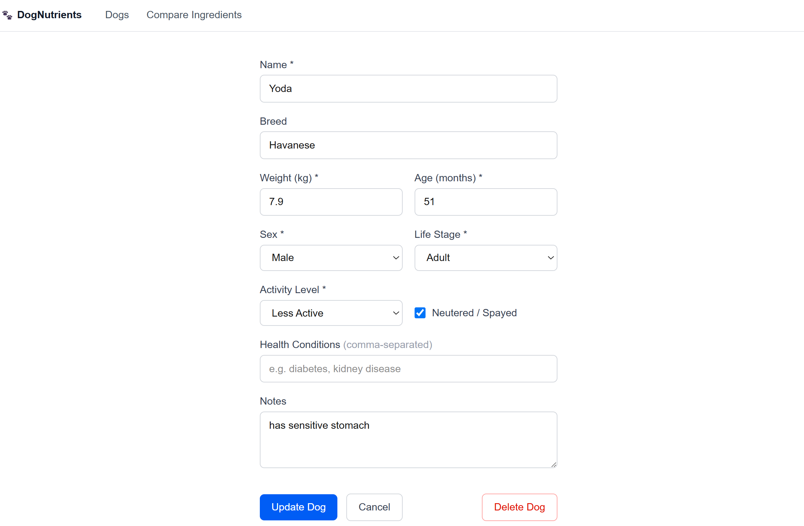
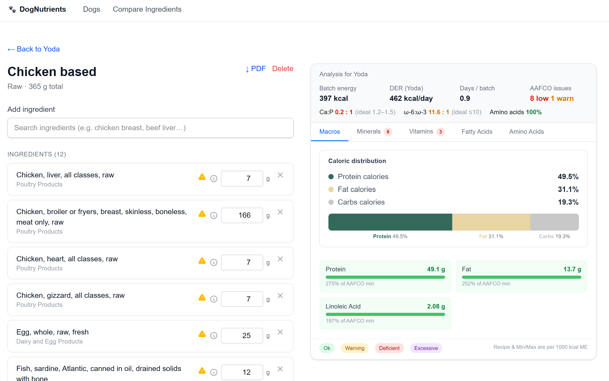
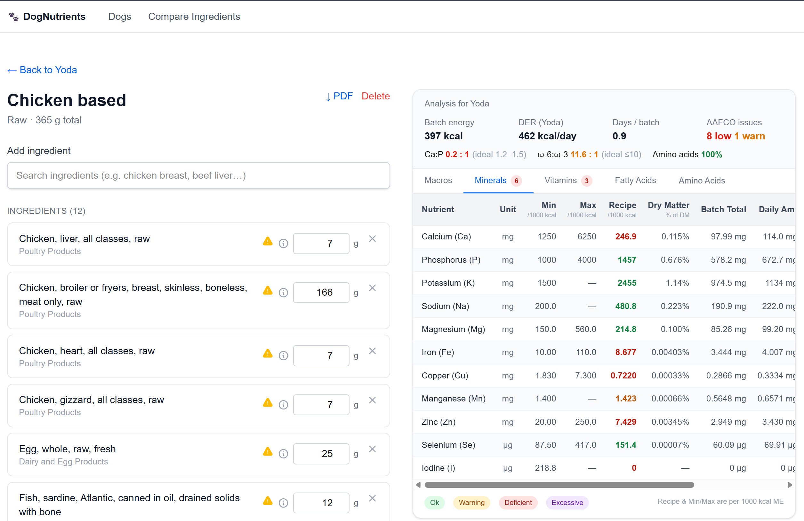
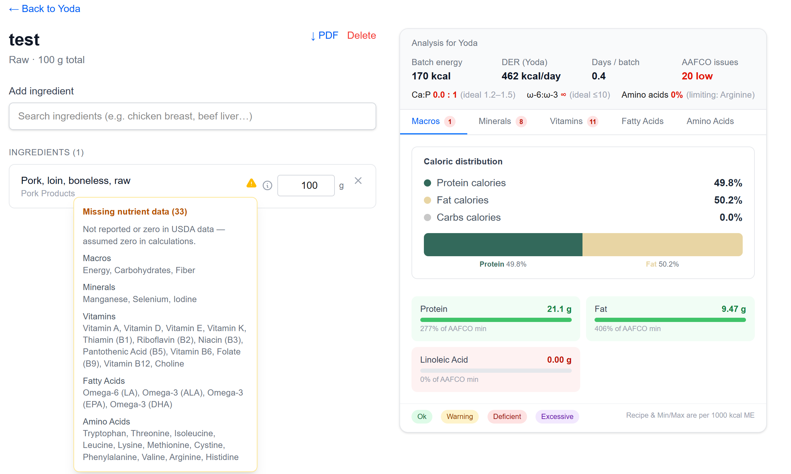
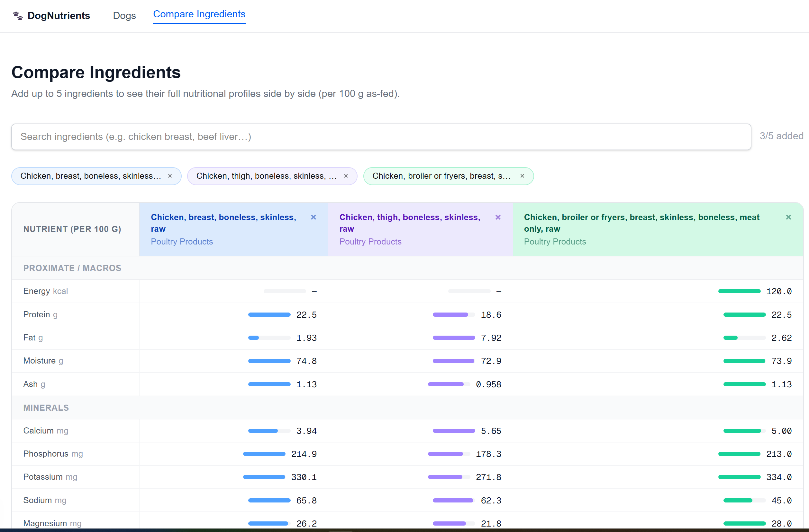

# 🐾 Dog Nutrient Calculator

A web app for building and analyzing **home-cooked dog food recipes** against veterinary nutrition standards. Add ingredients from the USDA food database, adjust portions, and instantly see whether a recipe meets **AAFCO** and **NRC** requirements for your dog — then export a shareable PDF report.

> Built with Next.js 15, Prisma 7, and Neon serverless PostgreSQL.

---

## What it does

- **🐕 Dog profiles** — Track each dog's weight, life stage, activity level, and sex to calculate personalized daily energy needs.
- **🥘 Recipe builder** — Search real ingredients from the [USDA FoodData Central](https://fdc.nal.usda.gov/) database, add them to a recipe, and tune weights with live feedback.
- **🍳 Cooking corrections** — Accounts for moisture loss and vitamin degradation based on how each ingredient is cooked (raw, boiled, baked, etc.).
- **📊 Real-time nutrition analysis** — As you edit, the app recalculates metabolic energy, dry-matter nutrient density, mineral ratios (like calcium-to-phosphorus), omega-3/6 balance, and amino acid completeness.
- **✅ AAFCO / NRC compliance** — See at a glance which nutrients meet, exceed, or fall short of the standards for your dog's life stage.
- **⚖️ Recipe comparison** — Compare multiple recipes side by side.
- **📄 PDF reports** — Generate a professional nutrition report to save or share with your veterinarian.

---

## Screenshots

### Dog profile

Set up each dog with the details that drive their daily energy needs — weight, age, sex, life stage, activity level, neuter status, and health notes.



### Recipe builder & macro analysis

Add ingredients and adjust weights on the left; the analysis panel on the right updates live with batch energy, the dog's daily energy requirement (DER), days per batch, AAFCO issues, and caloric distribution across protein, fat, and carbs.



### Mineral compliance

Every nutrient is checked against AAFCO min/max on a per-1000-kcal basis, with dry-matter percentage, batch totals, and daily amounts. Color coding flags anything deficient, excessive, or borderline — including the calcium-to-phosphorus ratio.



### Missing-data transparency

When the USDA record doesn't report a nutrient, the app tells you exactly which values were assumed to be zero — so you always know how complete your analysis really is.



### Compare ingredients

Line up to five ingredients side by side to see full nutritional profiles per 100 g — handy for swapping one protein or organ meat for another.



---

## Tech stack

| Layer | Technology |
|---|---|
| Framework | [Next.js 15](https://nextjs.org/) (App Router, React Server Components) |
| Language | TypeScript |
| Database | [Neon](https://neon.tech/) serverless PostgreSQL |
| ORM | [Prisma 7](https://www.prisma.io/) (Neon HTTP driver) |
| Styling | Tailwind CSS 4 |
| Client state | [Zustand](https://zustand-demo.pmnd.rs/) (recipe builder) |
| Server state | [TanStack Query v5](https://tanstack.com/query) (data fetching & mutations) |
| PDF export | [@react-pdf/renderer](https://react-pdf.org/) |
| Testing | [Vitest](https://vitest.dev/) + Testing Library |
| Data source | USDA FoodData Central API |

The nutrition calculation engine (`src/lib/nutrition/`) is **pure TypeScript** with no side effects, so it runs identically in the browser (for live UI updates) and on the server (for PDF generation).

---

## Getting started

### Prerequisites

- **Node.js 20 LTS**
- **[pnpm](https://pnpm.io/)** (this project uses pnpm exclusively — npm and yarn are disabled)
- A free **[Neon](https://neon.tech/)** PostgreSQL database
- A free **[USDA FoodData Central API key](https://fdc.nal.usda.gov/api-key-signup.html)**

### 1. Install dependencies

```bash
pnpm install
```

### 2. Configure environment variables

Create a `.env` file in the project root:

```env
DATABASE_URL=      # Neon pooled connection (used at runtime)
DIRECT_URL=        # Neon direct connection (used by Prisma migrations only)
USDA_API_KEY=      # Your USDA FoodData Central API key
```

> Both connection strings come from your Neon dashboard. `DATABASE_URL` is the **pooled** connection; `DIRECT_URL` is the **direct** connection.

### 3. Set up the database

```bash
pnpm dlx prisma migrate dev     # Apply migrations
pnpm dlx prisma generate        # Generate the Prisma client
```

### 4. Run the dev server

```bash
pnpm dev
```

Open [http://localhost:3000](http://localhost:3000) to start building recipes.

---

## Scripts

| Command | Description |
|---|---|
| `pnpm dev` | Start the development server |
| `pnpm build` | Production build |
| `pnpm start` | Run the production server |
| `pnpm lint` | Run ESLint |
| `pnpm test` | Run the Vitest test suite |

---

## How the nutrition engine works

Each time a recipe changes, the engine (`src/lib/nutrition/engine.ts`) runs these steps in order:

1. **Scale** each ingredient's nutrients by its weight.
2. **Apply cooking corrections** for moisture loss and vitamin degradation.
3. **Sum** nutrients across all ingredients.
4. **Calculate metabolic energy** using Standard Atwater factors for home-cooked food.
5. **Convert to dry-matter basis** so nutrient density is comparable across recipes.
6. **Normalize** to a per-1000-kcal basis.
7. **Evaluate AAFCO / NRC compliance** for the dog's life stage.
8. **Compute** mineral ratios, omega balance, and amino acid completeness.

Ingredient data is fetched once from the USDA API and cached in the database (permanent for ingredients, 90-day TTL for search results), so repeat lookups are instant and stay within API limits.

---

## Project structure

```
src/
├── app/                      # Next.js App Router pages & API routes
│   ├── dogs/                 # Dog profiles, recipes, recipe builder
│   ├── compare/              # Side-by-side recipe comparison
│   └── api/                  # Route handlers (dogs, recipes, ingredients, reports)
├── lib/
│   ├── nutrition/            # Pure-TS calculation engine (energy, DMB, AAFCO, ...)
│   ├── usda/                 # USDA API client, nutrient mapping, parsing
│   ├── pdf/                  # PDF report document
│   └── schemas/              # Zod validation schemas
├── stores/                   # Zustand recipe-builder store
prisma/
└── schema.prisma             # Dog, Recipe, RecipeItem, Ingredient, ... models
```

---

## Deployment

The app is designed to deploy to **[Vercel](https://vercel.com/)** with a Neon database. Add the three environment variables above to your Vercel project settings, and Vercel will build and host it with zero additional configuration.

---

## ⚠️ Disclaimer

This tool is for **educational and informational purposes only** and is not a substitute for professional veterinary advice. Always consult a licensed veterinarian or a board-certified veterinary nutritionist before making changes to your dog's diet.

---

## License

Released under the [MIT License](LICENSE) — you're free to use, modify, and distribute this code, provided the copyright notice is retained.
